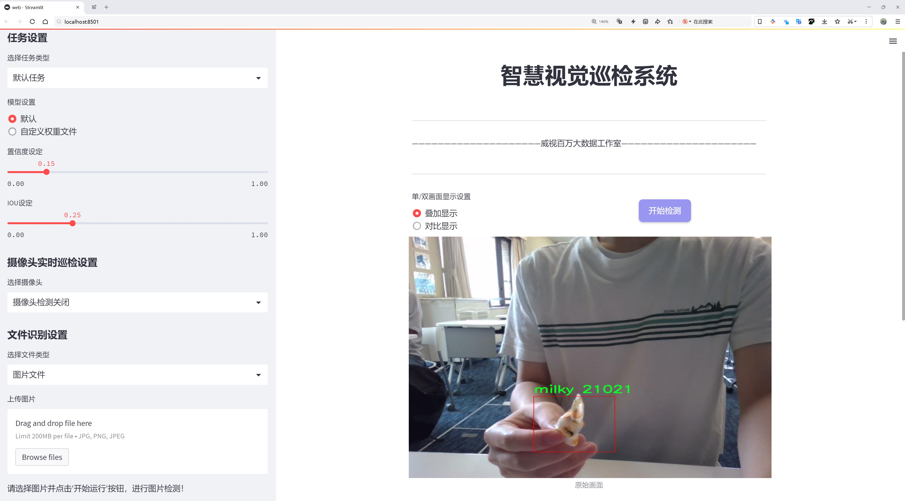
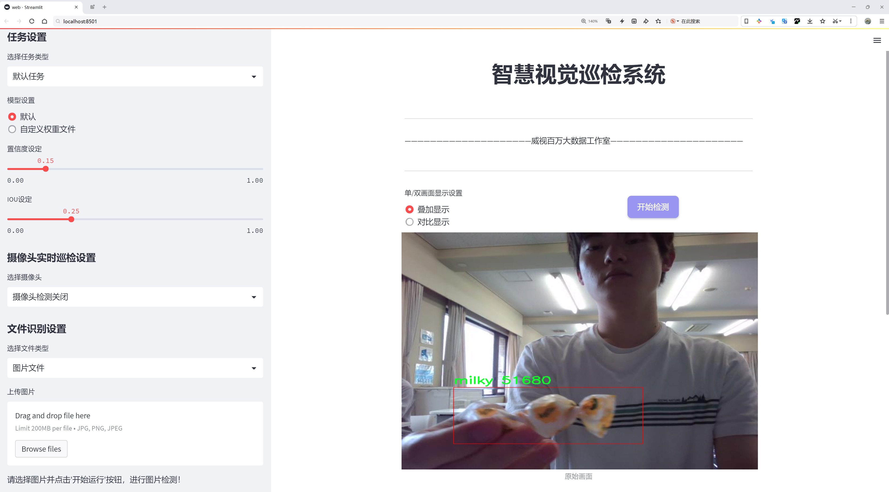
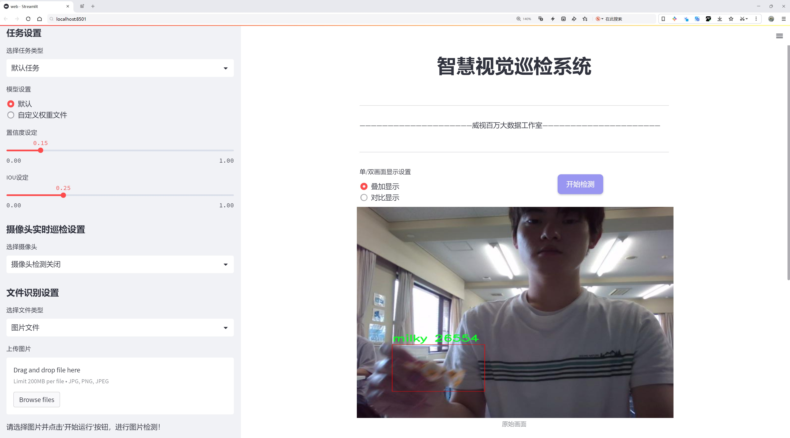
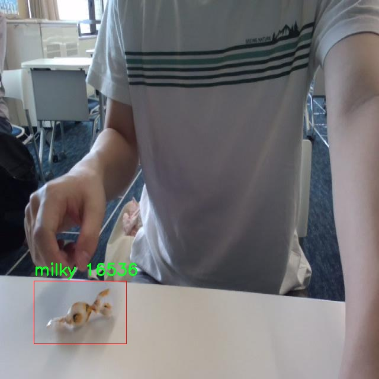
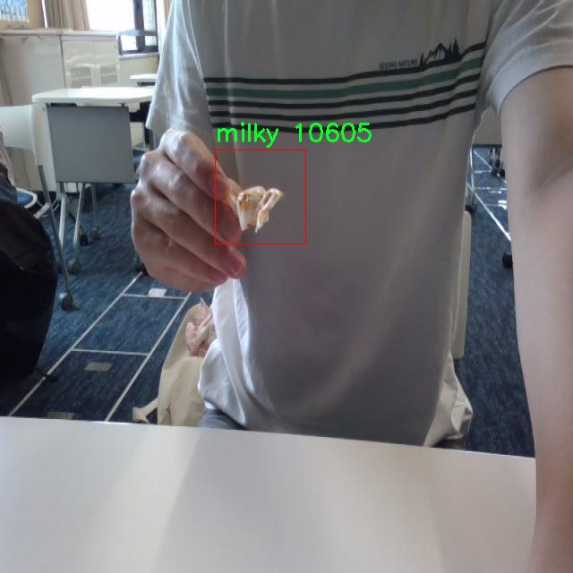
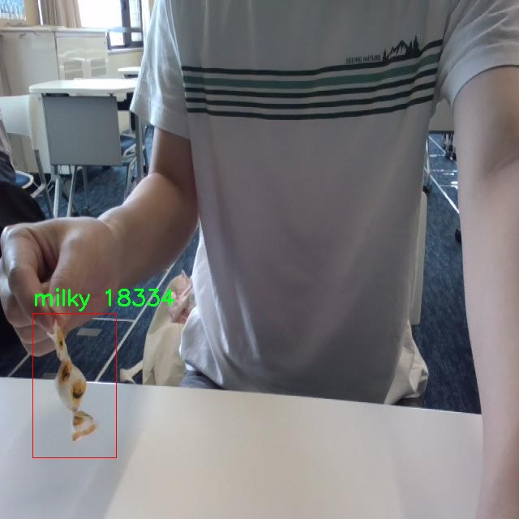
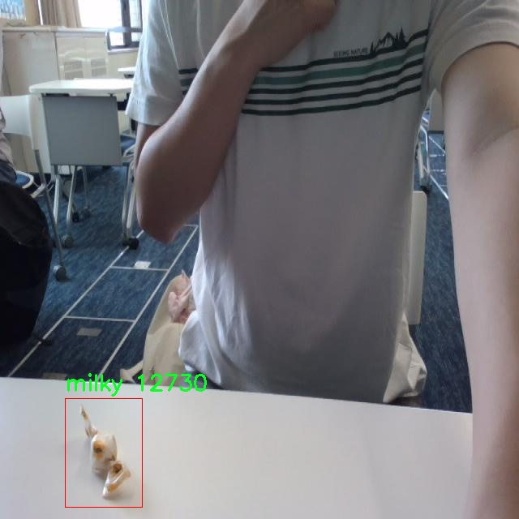
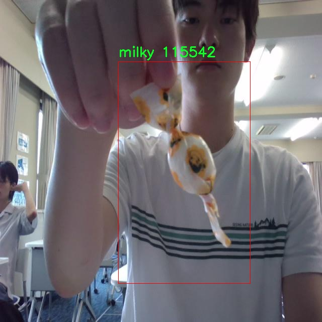

# 奶糖检测检测系统源码分享
 # [一条龙教学YOLOV8标注好的数据集一键训练_70+全套改进创新点发刊_Web前端展示]

### 1.研究背景与意义

项目参考[AAAI Association for the Advancement of Artificial Intelligence](https://gitee.com/qunmasj/projects)

项目来源[AACV Association for the Advancement of Computer Vision](https://github.com/qunshansj/good)

研究背景与意义

随着计算机视觉技术的快速发展，物体检测在各个领域的应用愈发广泛，尤其是在食品安全、质量控制和自动化生产等方面。奶糖作为一种受欢迎的零食，其生产和销售过程中的质量检测显得尤为重要。传统的人工检测方法不仅效率低下，而且容易受到人为因素的影响，导致检测结果的不稳定性。因此，基于深度学习的自动化检测系统应运而生，成为提高奶糖生产效率和质量控制的重要手段。

YOLO（You Only Look Once）系列模型以其高效的实时检测能力和较高的准确率，成为物体检测领域的佼佼者。YOLOv8作为该系列的最新版本，进一步提升了模型的性能，特别是在小物体检测和复杂背景下的表现。尽管YOLOv8在许多应用场景中表现出色，但在特定领域，如奶糖的检测中，仍然存在一些挑战。例如，奶糖的外观特征可能因品牌、包装和生产批次的不同而有所差异，这使得模型在训练时需要足够的多样性和代表性的数据集来提高其泛化能力。

本研究旨在基于改进的YOLOv8模型，构建一个高效的奶糖检测系统。我们使用的数据集包含130张图像，专注于单一类别——奶糖。这一数据集虽然数量相对较少，但通过数据增强技术和迁移学习等方法，可以有效提升模型的性能。通过对YOLOv8模型的改进，我们将探索如何在保持高检测精度的同时，降低模型的计算复杂度，以便在实际应用中实现实时检测。

研究的意义不仅在于提升奶糖的检测效率，更在于为食品行业提供一种新的智能检测解决方案。通过自动化的检测系统，生产企业可以实时监控产品质量，及时发现并处理潜在的质量问题，从而降低食品安全风险。此外，该系统的成功实施将为其他食品类别的检测提供借鉴，推动计算机视觉技术在食品行业的进一步应用。

总之，基于改进YOLOv8的奶糖检测系统的研究，不仅具有重要的理论价值，也具备广泛的实际应用前景。通过这一研究，我们希望能够为食品安全领域贡献新的技术手段，促进智能制造的发展，同时为相关学术研究提供新的思路和方法。

### 2.图片演示







##### 注意：由于此博客编辑较早，上面“2.图片演示”和“3.视频演示”展示的系统图片或者视频可能为老版本，新版本在老版本的基础上升级如下：（实际效果以升级的新版本为准）

  （1）适配了YOLOV8的“目标检测”模型和“实例分割”模型，通过加载相应的权重（.pt）文件即可自适应加载模型。

  （2）支持“图片识别”、“视频识别”、“摄像头实时识别”三种识别模式。

  （3）支持“图片识别”、“视频识别”、“摄像头实时识别”三种识别结果保存导出，解决手动导出（容易卡顿出现爆内存）存在的问题，识别完自动保存结果并导出到tempDir中。

  （4）支持Web前端系统中的标题、背景图等自定义修改，后面提供修改教程。

  另外本项目提供训练的数据集和训练教程,暂不提供权重文件（best.pt）,需要您按照教程进行训练后实现图片演示和Web前端界面演示的效果。

### 3.视频演示

[3.1 视频演示](https://www.bilibili.com/video/BV1JFHYeBEuJ/?vd_source=ff015de2d29cbe2a9cdbfa7064407a08)

### 4.数据集信息展示

数据集信息展示

在本研究中，我们使用了名为“milky”的数据集，以训练和改进YOLOv8模型在奶糖检测任务中的表现。该数据集专注于特定的目标类别，即奶糖，旨在提升计算机视觉系统在这一领域的准确性和鲁棒性。数据集的设计考虑到了多样性和代表性，确保模型能够在各种环境和条件下有效识别奶糖。

“milky”数据集包含丰富的图像样本，涵盖了不同品牌、包装和形态的奶糖。这些样本不仅展示了奶糖的多样性，还考虑到了光照、背景和视角的变化，使得模型在实际应用中能够更好地适应各种场景。数据集中的图像经过精心挑选和标注，确保每个样本都准确反映了目标类别的特征。通过这种方式，我们希望模型能够学习到奶糖的独特视觉特征，从而提高其检测精度。

在数据集的构建过程中，我们特别关注了数据的质量和数量。虽然“milky”数据集的类别数量仅为1，但这并不妨碍其在训练中的有效性。通过集中于单一类别，我们能够深入挖掘奶糖的各类特征，减少模型在多类别任务中可能遇到的混淆。数据集中的图像样本数量经过精心设计，以确保模型能够在有限的类别中获得足够的学习信息，从而提升其在实际应用中的表现。

此外，为了增强模型的泛化能力，我们还对数据集进行了多种数据增强处理。这些处理包括随机裁剪、旋转、缩放和颜色调整等，旨在模拟现实世界中可能遇到的各种情况。通过这些增强手段，我们不仅丰富了数据集的多样性，还有效提高了模型的鲁棒性，使其能够在不同的环境条件下保持良好的检测性能。

在训练过程中，我们将“milky”数据集与YOLOv8模型相结合，利用其先进的特征提取和目标检测能力。YOLOv8以其高效的推理速度和优越的检测精度，成为了本研究的理想选择。通过对“milky”数据集的深入学习，模型能够识别出奶糖的细微特征，并在复杂背景中准确定位目标。这一过程不仅验证了数据集的有效性，也为后续的应用提供了坚实的基础。

总之，“milky”数据集在本研究中发挥了至关重要的作用。它不仅为YOLOv8模型的训练提供了丰富的样本，还通过多样化的图像和数据增强策略，确保了模型在奶糖检测任务中的高效性和准确性。随着技术的不断进步，我们期待这一数据集能够为未来的研究和应用提供更多的可能性，推动奶糖检测技术的发展。











### 5.全套项目环境部署视频教程（零基础手把手教学）

[5.1 环境部署教程链接（零基础手把手教学）](https://www.ixigua.com/7404473917358506534?logTag=c807d0cbc21c0ef59de5)


[5.2 安装Python虚拟环境创建和依赖库安装视频教程链接（零基础手把手教学）](https://www.ixigua.com/7404474678003106304?logTag=1f1041108cd1f708b01a)

### 6.手把手YOLOV8训练视频教程（零基础小白有手就能学会）

[6.1 环境部署教程链接（零基础手把手教学）](https://www.ixigua.com/7404477157818401292?logTag=d31a2dfd1983c9668658)

### 7.70+种全套YOLOV8创新点代码加载调参视频教程（一键加载写好的改进模型的配置文件）

[7.1 环境部署教程链接（零基础手把手教学）](https://www.ixigua.com/7404478314661806627?logTag=29066f8288e3f4eea3a4)

### 8.70+种全套YOLOV8创新点原理讲解（非科班也可以轻松写刊发刊，V10版本正在科研待更新）

由于篇幅限制，每个创新点的具体原理讲解就不一一展开，具体见下列网址中的创新点对应子项目的技术原理博客网址【Blog】：


[8.1 70+种全套YOLOV8创新点原理讲解链接](https://gitee.com/qunmasj/good)

### 9.系统功能展示（检测对象为举例，实际内容以本项目数据集为准）

图9.1.系统支持检测结果表格显示

  图9.2.系统支持置信度和IOU阈值手动调节

  图9.3.系统支持自定义加载权重文件best.pt(需要你通过步骤5中训练获得)

  图9.4.系统支持摄像头实时识别

  图9.5.系统支持图片识别

  图9.6.系统支持视频识别

  图9.7.系统支持识别结果文件自动保存

  图9.8.系统支持Excel导出检测结果数据


### 10.原始YOLOV8算法原理

原始YOLOv8算法原理

YOLOv8算法是由Ultralytics公司于2023年1月10日推出的最新版本，作为YOLO系列的又一次重大进化，它在YOLOv7的基础上进行了深度优化，旨在提升目标检测的精度和速度。YOLOv8采用了更深的卷积神经网络结构，标志着目标检测领域的一次重要技术突破。该算法的核心思想是将整个图像作为输入，直接在图像上进行目标检测和定位，而不需要依赖传统的滑动窗口或区域提议方法，这一创新显著提高了检测的效率和准确性。

在YOLOv8的架构中，主要分为输入层、主干网络、特征融合层和解耦头四个部分。输入层负责图像的预处理，包括数据增强和图像缩放等操作，以确保输入数据的多样性和适应性。YOLOv8的主干网络依然采用了YOLOv5的CSPDarknet思想，但在此基础上进行了改进，特别是将C3模块替换为C2f模块。C2f模块通过引入ELAN思想，增强了网络的梯度流动性，使得模型在深层次特征提取时能够更有效地缓解梯度消失的问题。这种设计不仅提升了特征提取的能力，还在保持模型轻量化的同时，确保了检测精度的提升。

特征融合层采用了PAN-FPN结构，旨在有效整合不同尺度的特征信息，以便于对各种尺寸的目标进行准确检测。通过自下而上的特征融合，YOLOv8能够将高层特征与中层和浅层特征进行深度结合，从而增强了模型对目标的感知能力。这种多尺度特征融合的策略，使得YOLOv8在处理复杂场景时表现得尤为出色，能够有效识别出不同大小和形状的目标。

YOLOv8的解耦头部分是其另一大创新之处。与传统的耦合头结构不同，YOLOv8采用了Anchor-Free的思想，彻底抛弃了以往的Anchor-Base方法。这一改变使得模型在进行目标检测时，不再依赖于预设的锚框，而是通过自适应的方式进行目标的分类和边框回归。这种解耦结构不仅简化了模型的设计，还提高了检测的灵活性和准确性。解耦头部分的输出特征图被设计为多个尺度，分别对应于不同大小的目标，从而实现了更为精准的目标定位。

在损失函数的设计上，YOLOv8引入了VFLLoss作为分类损失，并结合DFLLoss和CIoULoss来优化边框回归的效果。这种多重损失函数的组合，使得模型在训练过程中能够更好地应对样本不平衡的问题，尤其是在处理小目标时，能够有效提升检测精度。此外，YOLOv8还采用了TaskAligned的样本匹配策略，以更合理地分配正负样本，从而提高训练的效率和效果。

数据预处理方面，YOLOv8延续了YOLOv5的策略，采用了马赛克增强、混合增强、空间扰动和颜色扰动等多种数据增强手段。这些增强技术的引入，不仅丰富了训练数据的多样性，还提高了模型的泛化能力，使得YOLOv8在面对不同场景和条件时，依然能够保持较高的检测性能。

在性能方面，YOLOv8相较于前一版本YOLOv7，精度提升了43.23%，帧率提高了10.28倍，展现出卓越的性能优势。这一进步使得YOLOv8在智能监控、自动驾驶、人脸识别等多个应用场景中，能够提供更为精准和快速的目标检测服务。通过对比分析，YOLOv8在目标检测分析中展现出了更强的能力，为各种实际应用提供了可靠的技术支持。

综上所述，YOLOv8算法的原理与设计充分体现了现代目标检测技术的发展趋势。通过深度优化的网络结构、创新的特征融合策略和高效的损失函数设计，YOLOv8不仅提升了目标检测的精度和速度，还为后续的研究和应用提供了新的思路和方向。随着YOLOv8的广泛应用，目标检测技术将迎来更加广阔的发展前景。


### 11.项目核心源码讲解（再也不用担心看不懂代码逻辑）

#### 11.1 ui.py

以下是经过精简和注释的核心代码：

```python
import sys
import subprocess

def run_script(script_path):
    """
    使用当前 Python 环境运行指定的脚本。

    Args:
        script_path (str): 要运行的脚本路径
    """
    # 获取当前 Python 解释器的路径
    python_path = sys.executable

    # 构建运行命令，使用 streamlit 运行指定的脚本
    command = f'"{python_path}" -m streamlit run "{script_path}"'

    # 执行命令并等待其完成
    result = subprocess.run(command, shell=True)
    
    # 检查命令执行结果，如果返回码不为0，则表示出错
    if result.returncode != 0:
        print("脚本运行出错。")

# 主程序入口
if __name__ == "__main__":
    # 指定要运行的脚本路径
    script_path = "web.py"  # 这里可以直接指定脚本名，假设它在当前目录

    # 调用函数运行脚本
    run_script(script_path)
```

### 代码说明：
1. **导入模块**：
   - `sys`：用于获取当前 Python 解释器的路径。
   - `subprocess`：用于执行外部命令。

2. **`run_script` 函数**：
   - 接受一个参数 `script_path`，表示要运行的 Python 脚本的路径。
   - 使用 `sys.executable` 获取当前 Python 解释器的路径。
   - 构建一个命令字符串，使用 `streamlit` 运行指定的脚本。
   - 使用 `subprocess.run` 执行命令，并等待其完成。
   - 检查命令的返回码，如果不为0，打印错误信息。

3. **主程序入口**：
   - 在 `__main__` 块中，指定要运行的脚本路径（此处为 `web.py`）。
   - 调用 `run_script` 函数来执行该脚本。

这个程序文件名为 `ui.py`，其主要功能是通过当前的 Python 环境来运行一个指定的脚本，具体是使用 Streamlit 框架来启动一个 Web 应用。

在文件的开头，首先导入了必要的模块，包括 `sys`、`os` 和 `subprocess`。其中，`sys` 模块用于访问与 Python 解释器相关的变量和函数，`os` 模块提供了与操作系统交互的功能，而 `subprocess` 模块则用于生成新的进程、连接到它们的输入/输出/错误管道，并获取它们的返回码。

接下来，定义了一个名为 `run_script` 的函数，该函数接受一个参数 `script_path`，表示要运行的脚本的路径。在函数内部，首先获取当前 Python 解释器的路径，这通过 `sys.executable` 实现。然后，构建一个命令字符串，该命令用于运行指定的脚本，具体是通过 Streamlit 框架的 `run` 命令来启动。

使用 `subprocess.run` 方法执行构建好的命令，并通过 `shell=True` 参数允许在 shell 中执行该命令。执行后，检查返回的结果码，如果返回码不为 0，表示脚本运行过程中出现了错误，程序会打印出相应的错误信息。

在文件的最后部分，使用 `if __name__ == "__main__":` 语句来确保只有在直接运行该脚本时才会执行后面的代码。在这里，指定了要运行的脚本路径为 `web.py`，并调用 `run_script` 函数来执行这个脚本。

总的来说，这个文件的功能是提供一个简单的接口，通过当前的 Python 环境来启动一个 Streamlit Web 应用，方便用户进行交互式数据展示和分析。

#### 11.2 ultralytics\engine\tuner.py

以下是代码中最核心的部分，并附上详细的中文注释：

```python
class Tuner:
    """
    负责YOLO模型超参数调优的类。

    该类通过在给定的迭代次数内变异YOLO模型的超参数，并重新训练模型以评估其性能，从而进化超参数。

    属性:
        space (dict): 超参数搜索空间，包含变异的边界和缩放因子。
        tune_dir (Path): 保存进化日志和结果的目录。
        tune_csv (Path): 保存进化日志的CSV文件路径。

    方法:
        _mutate(hyp: dict) -> dict:
            根据`self.space`中指定的边界变异给定的超参数。

        __call__():
            执行多次迭代的超参数进化。
    """

    def __init__(self, args=DEFAULT_CFG, _callbacks=None):
        """
        使用配置初始化Tuner。

        参数:
            args (dict, optional): 超参数进化的配置。
        """
        # 定义超参数搜索空间，包含每个超参数的最小值、最大值和可选的增益
        self.space = args.pop("space", None) or {
            "lr0": (1e-5, 1e-1),  # 初始学习率
            "lrf": (0.0001, 0.1),  # 最终学习率
            "momentum": (0.7, 0.98, 0.3),  # 动量
            "weight_decay": (0.0, 0.001),  # 权重衰减
            # 其他超参数...
        }
        self.args = get_cfg(overrides=args)  # 获取配置
        self.tune_dir = get_save_dir(self.args, name="tune")  # 保存目录
        self.tune_csv = self.tune_dir / "tune_results.csv"  # CSV文件路径
        self.callbacks = _callbacks or callbacks.get_default_callbacks()  # 回调函数
        LOGGER.info(f"Initialized Tuner instance with 'tune_dir={self.tune_dir}'")

    def _mutate(self, parent="single", n=5, mutation=0.8, sigma=0.2):
        """
        根据`self.space`中指定的边界和缩放因子变异超参数。

        参数:
            parent (str): 父选择方法：'single'或'weighted'。
            n (int): 考虑的父代数量。
            mutation (float): 在给定迭代中参数变异的概率。
            sigma (float): 高斯随机数生成器的标准差。

        返回:
            (dict): 包含变异超参数的字典。
        """
        if self.tune_csv.exists():  # 如果CSV文件存在，选择最佳超参数并变异
            # 选择父代
            x = np.loadtxt(self.tune_csv, ndmin=2, delimiter=",", skiprows=1)
            fitness = x[:, 0]  # 第一列为适应度
            n = min(n, len(x))  # 考虑的结果数量
            x = x[np.argsort(-fitness)][:n]  # 选择前n个
            w = x[:, 0] - x[:, 0].min() + 1e-6  # 权重

            # 根据选择方法变异超参数
            if parent == "single" or len(x) == 1:
                x = x[random.choices(range(n), weights=w)[0]]  # 加权选择
            elif parent == "weighted":
                x = (x * w.reshape(n, 1)).sum(0) / w.sum()  # 加权组合

            # 变异超参数
            r = np.random
            r.seed(int(time.time()))
            g = np.array([v[2] if len(v) == 3 else 1.0 for k, v in self.space.items()])  # 增益
            ng = len(self.space)
            v = np.ones(ng)
            while all(v == 1):  # 直到发生变化
                v = (g * (r.random(ng) < mutation) * r.randn(ng) * r.random() * sigma + 1).clip(0.3, 3.0)
            hyp = {k: float(x[i + 1] * v[i]) for i, k in enumerate(self.space.keys())}
        else:
            hyp = {k: getattr(self.args, k) for k in self.space.keys()}

        # 限制在边界内
        for k, v in self.space.items():
            hyp[k] = max(hyp[k], v[0])  # 下限
            hyp[k] = min(hyp[k], v[1])  # 上限
            hyp[k] = round(hyp[k], 5)  # 保留有效数字

        return hyp

    def __call__(self, model=None, iterations=10, cleanup=True):
        """
        当调用Tuner实例时执行超参数进化过程。

        该方法在每次迭代中执行以下步骤：
        1. 加载现有超参数或初始化新超参数。
        2. 使用`_mutate`方法变异超参数。
        3. 使用变异后的超参数训练YOLO模型。
        4. 将适应度分数和变异超参数记录到CSV文件中。

        参数:
           model (Model): 预初始化的YOLO模型。
           iterations (int): 运行进化的代数。
           cleanup (bool): 是否删除迭代权重以减少存储空间。

        注意:
           该方法利用`self.tune_csv`路径对象读取和记录超参数及适应度分数。
        """
        t0 = time.time()
        best_save_dir, best_metrics = None, None
        (self.tune_dir / "weights").mkdir(parents=True, exist_ok=True)  # 创建权重保存目录
        for i in range(iterations):
            # 变异超参数
            mutated_hyp = self._mutate()
            LOGGER.info(f"Starting iteration {i + 1}/{iterations} with hyperparameters: {mutated_hyp}")

            metrics = {}
            train_args = {**vars(self.args), **mutated_hyp}  # 合并超参数
            save_dir = get_save_dir(get_cfg(train_args))  # 获取保存目录
            weights_dir = save_dir / "weights"  # 权重目录
            ckpt_file = weights_dir / ("best.pt" if (weights_dir / "best.pt").exists() else "last.pt")  # 检查权重文件

            try:
                # 训练YOLO模型
                cmd = ["yolo", "train", *(f"{k}={v}" for k, v in train_args.items())]
                return_code = subprocess.run(cmd, check=True).returncode
                metrics = torch.load(ckpt_file)["train_metrics"]  # 加载训练指标
                assert return_code == 0, "training failed"

            except Exception as e:
                LOGGER.warning(f"WARNING ❌️ training failure for hyperparameter tuning iteration {i + 1}\n{e}")

            # 保存结果和变异超参数到CSV
            fitness = metrics.get("fitness", 0.0)
            log_row = [round(fitness, 5)] + [mutated_hyp[k] for k in self.space.keys()]
            headers = "" if self.tune_csv.exists() else (",".join(["fitness"] + list(self.space.keys())) + "\n")
            with open(self.tune_csv, "a") as f:
                f.write(headers + ",".join(map(str, log_row)) + "\n")

            # 获取最佳结果
            x = np.loadtxt(self.tune_csv, ndmin=2, delimiter=",", skiprows=1)
            fitness = x[:, 0]  # 第一列为适应度
            best_idx = fitness.argmax()  # 获取最佳适应度索引
            best_is_current = best_idx == i  # 检查当前是否为最佳

            if best_is_current:
                best_save_dir = save_dir
                best_metrics = {k: round(v, 5) for k, v in metrics.items()}
                for ckpt in weights_dir.glob("*.pt"):
                    shutil.copy2(ckpt, self.tune_dir / "weights")  # 复制最佳权重

            elif cleanup:
                shutil.rmtree(ckpt_file.parent)  # 删除迭代权重目录以减少存储空间

            # 绘制调优结果
            plot_tune_results(self.tune_csv)

            # 保存和打印调优结果
            header = (
                f'Iterations complete ✅ ({time.time() - t0:.2f}s)\n'
                f'Results saved to {self.tune_dir}\n'
                f'Best fitness={fitness[best_idx]} observed at iteration {best_idx + 1}\n'
                f'Best fitness metrics are {best_metrics}\n'
                f'Best fitness model is {best_save_dir}\n'
            )
            LOGGER.info("\n" + header)
            data = {k: float(x[best_idx, i + 1]) for i, k in enumerate(self.space.keys())}
            yaml_save(
                self.tune_dir / "best_hyperparameters.yaml",
                data=data,
                header=remove_colorstr(header.replace(self.prefix, "# ")) + "\n",
            )
            yaml_print(self.tune_dir / "best_hyperparameters.yaml")  # 打印最佳超参数
```

### 代码说明：
1. **Tuner类**：负责超参数调优的核心类，包含超参数的变异和训练过程。
2. **__init__方法**：初始化Tuner实例，设置超参数搜索空间和其他配置。
3. **_mutate方法**：根据已有的超参数变异出新的超参数，确保新的超参数在指定的边界内。
4. **__call__方法**：执行超参数进化的主流程，包括变异、训练和结果记录。

这个程序文件 `ultralytics\engine\tuner.py` 是用于超参数调优的模块，专门针对 Ultralytics YOLO 模型，支持对象检测、实例分割、图像分类、姿态估计和多目标跟踪等任务。超参数调优是一个系统性搜索最佳超参数集的过程，这对于深度学习模型（如 YOLO）尤其重要，因为超参数的微小变化可能会导致模型性能的显著差异。

在文件中，首先导入了一些必要的库和模块，包括随机数生成、文件操作、时间处理、NumPy 和 PyTorch 等。接着，定义了一个 `Tuner` 类，负责 YOLO 模型的超参数调优。该类的主要功能是通过多次迭代演化超参数，并根据给定的搜索空间对其进行变异，然后重新训练模型以评估其性能。

`Tuner` 类的构造函数初始化了一些属性，包括超参数的搜索空间、调优结果保存目录和 CSV 文件路径。搜索空间定义了每个超参数的取值范围和变异因子。类中还定义了一些方法，例如 `_mutate` 方法用于在指定的边界内变异超参数，`__call__` 方法则执行超参数演化过程。

在 `_mutate` 方法中，如果存在之前的调优结果（CSV 文件），则会选择最佳的超参数进行变异。通过随机选择和加权组合的方式，生成新的超参数，并确保其在预设的边界内。`__call__` 方法则负责整个调优过程，包括加载现有超参数、变异超参数、训练模型以及记录结果。

在每次迭代中，程序会尝试训练 YOLO 模型，并记录训练的性能指标。如果训练成功，会将结果和变异后的超参数保存到 CSV 文件中，并更新最佳结果。最后，程序还会生成调优结果的可视化图表，并将最佳超参数保存为 YAML 文件。

整体来看，这个模块为 YOLO 模型的超参数调优提供了一个系统化的框架，能够有效地探索和优化模型性能。

#### 11.3 ultralytics\models\yolo\model.py

```python
# 引入必要的模块和类
from ultralytics.engine.model import Model
from ultralytics.models import yolo
from ultralytics.nn.tasks import ClassificationModel, DetectionModel, OBBModel, PoseModel, SegmentationModel

class YOLO(Model):
    """YOLO (You Only Look Once) 目标检测模型的类定义。"""

    @property
    def task_map(self):
        """将任务类型映射到相应的模型、训练器、验证器和预测器类。

        返回一个字典，其中包含不同任务类型（分类、检测、分割、姿态估计、OBB）的相关类。
        每个任务类型都有对应的模型、训练器、验证器和预测器。
        """
        return {
            "classify": {  # 分类任务
                "model": ClassificationModel,  # 分类模型
                "trainer": yolo.classify.ClassificationTrainer,  # 分类训练器
                "validator": yolo.classify.ClassificationValidator,  # 分类验证器
                "predictor": yolo.classify.ClassificationPredictor,  # 分类预测器
            },
            "detect": {  # 检测任务
                "model": DetectionModel,  # 检测模型
                "trainer": yolo.detect.DetectionTrainer,  # 检测训练器
                "validator": yolo.detect.DetectionValidator,  # 检测验证器
                "predictor": yolo.detect.DetectionPredictor,  # 检测预测器
            },
            "segment": {  # 分割任务
                "model": SegmentationModel,  # 分割模型
                "trainer": yolo.segment.SegmentationTrainer,  # 分割训练器
                "validator": yolo.segment.SegmentationValidator,  # 分割验证器
                "predictor": yolo.segment.SegmentationPredictor,  # 分割预测器
            },
            "pose": {  # 姿态估计任务
                "model": PoseModel,  # 姿态模型
                "trainer": yolo.pose.PoseTrainer,  # 姿态训练器
                "validator": yolo.pose.PoseValidator,  # 姿态验证器
                "predictor": yolo.pose.PosePredictor,  # 姿态预测器
            },
            "obb": {  # 方向边界框任务
                "model": OBBModel,  # OBB模型
                "trainer": yolo.obb.OBBTrainer,  # OBB训练器
                "validator": yolo.obb.OBBValidator,  # OBB验证器
                "predictor": yolo.obb.OBBPredictor,  # OBB预测器
            },
        }
```

### 代码核心部分说明：
1. **YOLO类**：继承自`Model`类，表示YOLO目标检测模型的实现。
2. **task_map属性**：定义了一个映射关系，关联不同的任务类型（如分类、检测、分割等）与其对应的模型、训练器、验证器和预测器。这个映射使得在使用YOLO模型时，可以方便地选择和调用不同的功能模块。

这个程序文件定义了一个名为 `YOLO` 的类，该类继承自 `Model`，主要用于实现 YOLO（You Only Look Once）目标检测模型。文件中首先导入了一些必要的模块和类，包括模型、训练器、验证器和预测器等，这些都是实现不同任务所需的组件。

在 `YOLO` 类中，定义了一个名为 `task_map` 的属性，这个属性返回一个字典，字典的键是不同的任务类型，如分类（classify）、检测（detect）、分割（segment）、姿态估计（pose）和有向边界框（obb）。每个任务类型对应一个包含模型、训练器、验证器和预测器的子字典。

具体来说，对于每种任务，`task_map` 提供了以下信息：
- 对于分类任务，使用 `ClassificationModel` 作为模型，`ClassificationTrainer` 作为训练器，`ClassificationValidator` 作为验证器，`ClassificationPredictor` 作为预测器。
- 对于检测任务，使用 `DetectionModel`，并相应地指定训练器、验证器和预测器。
- 对于分割任务，使用 `SegmentationModel`，同样指定了相关的训练、验证和预测组件。
- 对于姿态估计任务，使用 `PoseModel`，并指定了相关的组件。
- 对于有向边界框任务，使用 `OBBModel`，并提供了相应的训练、验证和预测工具。

通过这种方式，`YOLO` 类可以灵活地处理不同的计算机视觉任务，用户可以根据需要选择合适的模型和工具进行训练和推理。整体上，这个文件的设计使得 YOLO 模型能够高效地支持多种视觉任务，并且提供了清晰的结构以便于扩展和维护。

#### 11.4 utils.py

以下是代码中最核心的部分，并附上详细的中文注释：

```python
import os
import cv2
import pandas as pd
import streamlit as st
from PIL import Image
from QtFusion.path import abs_path

def save_uploaded_file(uploaded_file):
    """
    保存上传的文件到服务器上。

    Args:
        uploaded_file (UploadedFile): 通过Streamlit上传的文件。

    Returns:
        str: 保存文件的完整路径，如果没有文件上传则返回 None。
    """
    # 检查是否有文件上传
    if uploaded_file is not None:
        base_path = "tempDir"  # 定义文件保存的基本路径

        # 如果路径不存在，创建这个路径
        if not os.path.exists(base_path):
            os.makedirs(base_path)
        
        # 获取文件的完整路径
        file_path = os.path.join(base_path, uploaded_file.name)

        # 以二进制写模式打开文件
        with open(file_path, "wb") as f:
            f.write(uploaded_file.getbuffer())  # 写入文件内容

        return file_path  # 返回文件的完整路径

    return None  # 如果没有文件上传，返回 None


def concat_results(result, location, confidence, time):
    """
    显示检测结果。

    Args:
        result (str): 检测结果。
        location (str): 检测位置。
        confidence (str): 置信度。
        time (str): 检测用时。

    Returns:
        DataFrame: 包含检测结果的 DataFrame。
    """
    # 创建一个包含这些信息的字典
    result_data = {
        "识别结果": [result],
        "位置": [location],
        "置信度": [confidence],
        "用时": [time]
    }

    # 将字典转换为 DataFrame
    results_df = pd.DataFrame(result_data)
    return results_df


def get_camera_names():
    """
    获取可用摄像头名称列表。

    Returns:
        list: 返回包含“未启用摄像头”和可用摄像头索引号的列表。
    """
    camera_names = ["摄像头检测关闭", "0"]  # 初始化摄像头名称列表
    max_test_cameras = 10  # 定义要测试的最大摄像头数量

    # 循环测试每个摄像头
    for i in range(max_test_cameras):
        cap = cv2.VideoCapture(i, cv2.CAP_DSHOW)  # 尝试打开摄像头
        if cap.isOpened() and str(i) not in camera_names:  # 如果摄像头打开成功
            camera_names.append(str(i))  # 将摄像头索引添加到列表中
            cap.release()  # 释放摄像头资源
    
    # 如果没有找到可用的摄像头，输出提示信息
    if len(camera_names) == 1:
        st.write("未找到可用的摄像头")
    
    return camera_names  # 返回可用摄像头名称列表
```

### 代码核心部分说明：
1. **保存上传文件的功能** (`save_uploaded_file`): 该函数用于保存用户通过Streamlit上传的文件到服务器的指定目录，并返回文件的完整路径。
2. **显示检测结果的功能** (`concat_results`): 该函数将检测结果、位置、置信度和用时信息整合到一个Pandas DataFrame中，便于后续处理和展示。
3. **获取可用摄像头名称的功能** (`get_camera_names`): 该函数通过尝试打开多个摄像头，返回可用摄像头的索引列表，帮助用户选择可用的摄像头。

这个程序文件 `utils.py` 包含了一些用于处理文件上传、显示检测结果、加载默认图片以及获取可用摄像头名称的实用函数。以下是对每个函数的详细说明。

首先，`save_uploaded_file` 函数用于保存用户通过 Streamlit 上传的文件。它接收一个参数 `uploaded_file`，该参数是用户上传的文件对象。函数首先检查是否有文件被上传，如果有，它会定义一个基本路径 `tempDir` 用于保存文件。如果该路径不存在，函数会创建这个目录。接着，函数获取上传文件的完整路径，并以二进制写模式打开文件，将其内容写入到指定路径中。最后，函数返回保存文件的完整路径，如果没有文件上传，则返回 `None`。

接下来，`concat_results` 函数用于显示检测结果。它接收四个参数：`result`（检测结果）、`location`（检测位置）、`confidence`（置信度）和 `time`（检测用时）。函数将这些信息组织成一个字典，并使用 Pandas 创建一个 DataFrame 对象，最后返回这个 DataFrame，以便后续展示或处理。

`load_default_image` 函数用于加载默认图片。它没有参数，返回一个默认图片对象。函数通过调用 `abs_path` 函数获取默认图片的绝对路径，然后使用 PIL 库的 `Image.open` 方法打开并返回该图片。

最后，`get_camera_names` 函数用于获取可用摄像头的名称列表。它返回一个包含“未启用摄像头”和可用摄像头索引号的列表。函数首先定义一个最大测试摄像头数量 `max_test_cameras`，然后循环测试每个摄像头的可用性。如果摄像头能够成功打开，它会将其索引号添加到列表中。最后，如果没有找到可用的摄像头，函数会在 Streamlit 界面上显示相应的提示信息。

整体来看，这个文件提供了一些基础的工具函数，方便在使用 Streamlit 构建应用时进行文件处理、结果展示和摄像头管理。

#### 11.5 ultralytics\nn\__init__.py

```python
# 导入必要的任务模块
from .tasks import (
    BaseModel,  # 基础模型类
    ClassificationModel,  # 分类模型类
    DetectionModel,  # 检测模型类
    SegmentationModel,  # 分割模型类
    attempt_load_one_weight,  # 尝试加载单个权重
    attempt_load_weights,  # 尝试加载多个权重
    guess_model_scale,  # 猜测模型的缩放比例
    guess_model_task,  # 猜测模型的任务类型
    parse_model,  # 解析模型结构
    torch_safe_load,  # 安全加载PyTorch模型
    yaml_model_load,  # 从YAML文件加载模型
)

# 定义模块的公开接口
__all__ = (
    "attempt_load_one_weight",  # 公开加载单个权重的函数
    "attempt_load_weights",  # 公开加载多个权重的函数
    "parse_model",  # 公开解析模型的函数
    "yaml_model_load",  # 公开从YAML文件加载模型的函数
    "guess_model_task",  # 公开猜测模型任务的函数
    "guess_model_scale",  # 公开猜测模型缩放比例的函数
    "torch_safe_load",  # 公开安全加载PyTorch模型的函数
    "DetectionModel",  # 公开检测模型类
    "SegmentationModel",  # 公开分割模型类
    "ClassificationModel",  # 公开分类模型类
    "BaseModel",  # 公开基础模型类
)
```

### 注释说明：
1. **导入模块**：从当前包的 `tasks` 模块中导入了一系列与模型相关的类和函数，这些类和函数用于模型的加载、解析和管理。
2. **模型类**：
   - `BaseModel`：基础模型类，可能包含所有模型的共通功能。
   - `ClassificationModel`：用于图像分类的模型类。
   - `DetectionModel`：用于目标检测的模型类。
   - `SegmentationModel`：用于图像分割的模型类。
3. **函数**：
   - `attempt_load_one_weight`：尝试加载单个模型权重。
   - `attempt_load_weights`：尝试加载多个模型权重。
   - `guess_model_scale`：根据输入信息猜测模型的缩放比例。
   - `guess_model_task`：根据输入信息猜测模型的任务类型（如分类、检测等）。
   - `parse_model`：解析模型的结构信息。
   - `torch_safe_load`：安全地加载PyTorch模型，防止潜在的错误。
   - `yaml_model_load`：从YAML配置文件中加载模型的参数和结构。
4. **公开接口**：`__all__` 列表定义了模块的公开接口，只有在这个列表中的类和函数才能被外部访问，这有助于控制模块的可用性和封装性。

这个程序文件是Ultralytics YOLO（You Only Look Once）项目的一部分，主要用于模型的定义和加载。文件中首先引入了一些来自`tasks`模块的类和函数，这些类和函数在模型的训练和推理过程中起着重要作用。

引入的类包括`BaseModel`、`ClassificationModel`、`DetectionModel`和`SegmentationModel`，它们分别代表不同类型的模型架构。`BaseModel`是所有模型的基类，而其他三个类则分别用于分类、检测和分割任务。这种设计使得代码结构清晰，便于扩展和维护。

此外，文件中还引入了一些函数，如`attempt_load_one_weight`和`attempt_load_weights`，它们用于加载模型权重，确保在模型推理时能够正确地应用训练好的参数。`guess_model_scale`和`guess_model_task`函数则用于推测模型的规模和任务类型，这在模型的自动配置中非常有用。

`parse_model`和`yaml_model_load`函数用于解析模型的配置和从YAML文件中加载模型设置，这样可以灵活地调整模型的超参数和结构。

最后，`__all__`变量定义了模块的公共接口，列出了可以被外部导入的类和函数。这种做法有助于控制模块的可见性，确保用户只访问到必要的部分，从而减少不必要的复杂性。

总的来说，这个文件为Ultralytics YOLO提供了一个模块化的结构，使得模型的创建、加载和使用变得更加高效和方便。

#### 11.6 train.py

以下是代码中最核心的部分，并附上详细的中文注释：

```python
import os
import torch
import yaml
from ultralytics import YOLO  # 导入YOLO模型库
from QtFusion.path import abs_path  # 导入路径处理工具

# 确定使用的设备，如果有可用的GPU则使用GPU，否则使用CPU
device = "0" if torch.cuda.is_available() else "cpu"

if __name__ == '__main__':  # 确保该模块被直接运行时才执行以下代码
    workers = 1  # 设置数据加载的工作进程数量
    batch = 2  # 设置每个批次的大小

    data_name = "data"  # 数据集名称
    # 获取数据集yaml文件的绝对路径
    data_path = abs_path(f'datasets/{data_name}/{data_name}.yaml', path_type='current')  
    unix_style_path = data_path.replace(os.sep, '/')  # 将路径转换为Unix风格

    # 获取数据集目录路径
    directory_path = os.path.dirname(unix_style_path)
    
    # 读取YAML文件，保持原有顺序
    with open(data_path, 'r') as file:
        data = yaml.load(file, Loader=yaml.FullLoader)
    
    # 如果YAML文件中有'path'项，则修改为当前目录路径
    if 'path' in data:
        data['path'] = directory_path
        # 将修改后的数据写回YAML文件
        with open(data_path, 'w') as file:
            yaml.safe_dump(data, file, sort_keys=False)

    # 加载预训练的YOLOv8模型，指定模型配置文件和任务类型
    model = YOLO(model='./ultralytics/cfg/models/v8/yolov8s.yaml', task='detect')  
    
    # 开始训练模型
    results2 = model.train(  
        data=data_path,  # 指定训练数据的配置文件路径
        device=device,  # 指定使用的设备
        workers=workers,  # 指定数据加载的工作进程数量
        imgsz=640,  # 指定输入图像的大小为640x640
        epochs=100,  # 指定训练的轮数为100
        batch=batch,  # 指定每个批次的大小
        name='train_v8_' + data_name  # 指定训练任务的名称
    )
```

### 代码说明：
1. **导入必要的库**：导入了处理文件和路径的库、深度学习框架PyTorch、YAML文件处理库以及YOLO模型库。
2. **设备选择**：根据系统是否有可用的GPU来选择使用的设备（GPU或CPU）。
3. **数据集路径处理**：获取数据集的YAML配置文件的绝对路径，并确保路径格式为Unix风格。
4. **读取和修改YAML文件**：读取YAML文件中的内容，修改其中的路径项为当前目录路径，并将修改后的内容写回文件。
5. **模型加载与训练**：加载YOLOv8模型，并使用指定的参数开始训练，包括数据路径、设备、工作进程数量、图像大小、训练轮数和批次大小。

这段代码是一个用于训练YOLOv8模型的Python脚本，文件名为`train.py`。首先，代码导入了必要的库，包括`os`、`torch`、`yaml`和`ultralytics`中的YOLO模型。接着，代码检查当前是否可以使用GPU，如果可以，则将设备设置为“0”，否则使用CPU。

在`__main__`块中，首先定义了一些训练参数，包括工作进程数`workers`和批次大小`batch`。接下来，指定了数据集的名称为“data”，并构建了该数据集的YAML配置文件的绝对路径。使用`abs_path`函数来获取路径，并将路径中的分隔符统一为Unix风格。

然后，代码获取了数据集目录的路径，并打开指定的YAML文件以读取数据。读取后，检查数据中是否包含`path`项，如果有，则将其修改为数据集的目录路径，并将更新后的数据写回到YAML文件中。

接下来，代码加载了YOLOv8模型的配置文件，准备进行目标检测任务。通过调用`model.train()`方法开始训练模型，传入的参数包括数据配置文件路径、设备类型、工作进程数、输入图像大小（640x640）、训练的epoch数量（100）以及每个批次的大小（2）。最后，指定了训练任务的名称，格式为“train_v8_”加上数据集名称。

整体来看，这段代码的主要功能是配置并启动YOLOv8模型的训练过程，确保训练数据的路径正确，并设置了训练的相关参数。

### 12.系统整体结构（节选）

### 程序整体功能和构架概括

该程序是一个基于Ultralytics YOLO（You Only Look Once）框架的目标检测系统，涵盖了模型的训练、推理、超参数调优、结果展示等多个方面。程序的架构采用模块化设计，便于扩展和维护。主要功能包括：

1. **用户界面**：通过`ui.py`提供了一个交互式界面，允许用户上传文件、查看检测结果等。
2. **模型训练**：`train.py`负责配置和启动YOLO模型的训练过程，支持多种任务类型。
3. **超参数调优**：`ultralytics\engine\tuner.py`实现了超参数的自动调优，以优化模型性能。
4. **模型定义**：`ultralytics\models\yolo\model.py`定义了YOLO模型的结构和任务映射。
5. **实用工具**：`utils.py`和其他工具文件提供了多种辅助功能，如文件处理、结果展示、摄像头管理等。

以下是各个文件功能的整理表格：

| 文件路径                                         | 功能描述                                                                                   |
|--------------------------------------------------|--------------------------------------------------------------------------------------------|
| `ui.py`                                         | 提供用户界面，允许文件上传、显示检测结果和加载默认图片等功能。                                       |
| `ultralytics\engine\tuner.py`                  | 实现YOLO模型的超参数调优，通过多次迭代演化超参数以优化模型性能。                                   |
| `ultralytics\models\yolo\model.py`             | 定义YOLO模型的结构，支持多种计算机视觉任务（分类、检测、分割等）。                               |
| `utils.py`                                      | 提供实用函数，如文件上传、结果展示、加载默认图片和获取可用摄像头名称等。                           |
| `ultralytics\nn\__init__.py`                   | 定义模型的加载和配置，提供模型和任务类型的映射。                                             |
| `train.py`                                      | 配置并启动YOLO模型的训练过程，设置训练参数和数据集路径。                                       |
| `ultralytics\data\utils.py`                     | 提供数据处理和增强的实用工具函数（假设，具体功能未提供）。                                       |
| `ultralytics\engine\results.py`                 | 处理和展示模型推理结果（假设，具体功能未提供）。                                               |
| `ultralytics\solutions\speed_estimation.py`     | 实现速度估计功能，可能用于评估模型的推理速度（假设，具体功能未提供）。                           |
| `ultralytics\utils\benchmarks.py`               | 提供基准测试功能，用于评估模型性能（假设，具体功能未提供）。                                     |

请注意，某些文件的具体功能可能需要根据实际代码进行详细分析，上述描述基于对文件名称和上下文的推测。

注意：由于此博客编辑较早，上面“11.项目核心源码讲解（再也不用担心看不懂代码逻辑）”中部分代码可能会优化升级，仅供参考学习，完整“训练源码”、“Web前端界面”和“70+种创新点源码”以“13.完整训练+Web前端界面+70+种创新点源码、数据集获取”的内容为准。

### 13.完整训练+Web前端界面+70+种创新点源码、数据集获取


https://mbd.pub/o/bread/ZpqZkpts